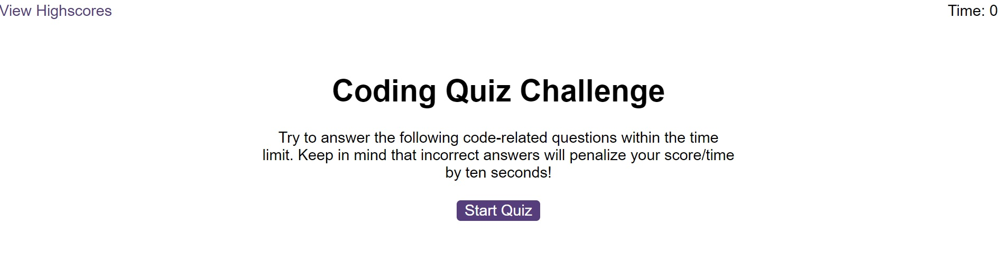
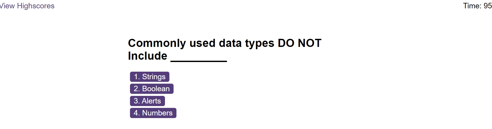

# Code-Quiz
A timed, multiple-choice coding quiz that can keep track of high scores and quiz-takers' initials.

# Project Title

# Code-Quiz 
A timed, multiple-choice questions coding quiz that can keep track of high scores and quiz-takers' initials.

## Description

The user is presented with timed multiple choice questions on JavaScript to test his/her knowledge
and compare with peers. Each incorrect answer results in a 10 seconds time penalty.
The current score is displayed and the 10 highest scores are saved and can be accessed by clicking the
high scores button.

This app will run in the browser and feature HTML, CSS and JavaScript.

### Dependencies

None

### Project Link

https://sfsl06.github.io/Code-Quiz/

## Authors

Contributors names and contact info

Sabeen Faisal 
sabeenjamil100@yahoo.com

## Built with

HTML
CSS
JavaScript

## Acknowledgments

https://www.w3schools.com/css/
